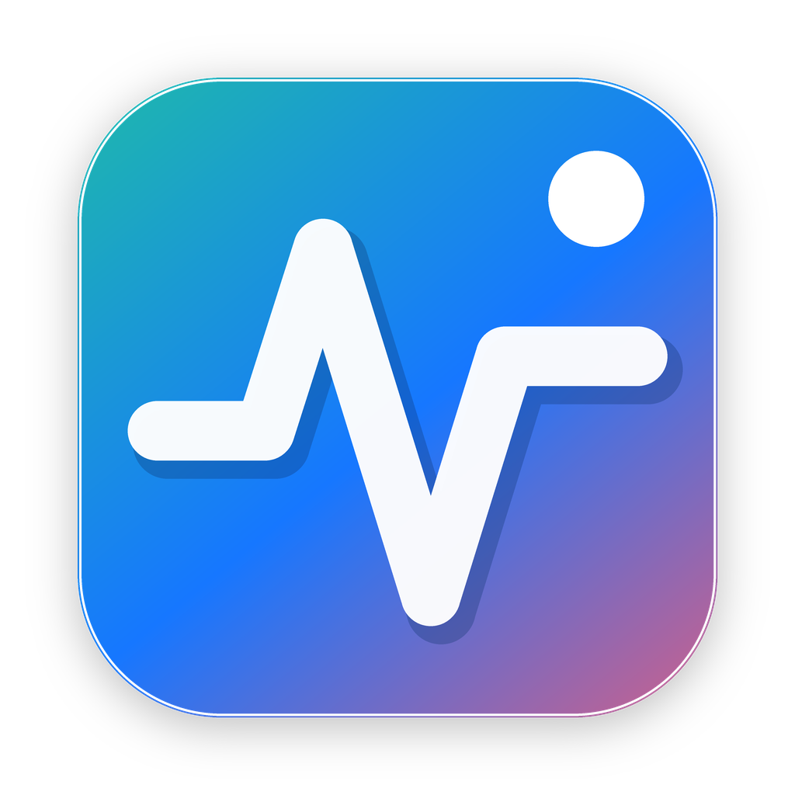
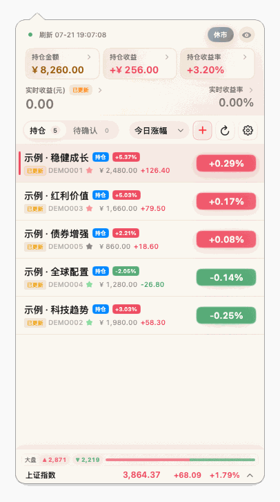
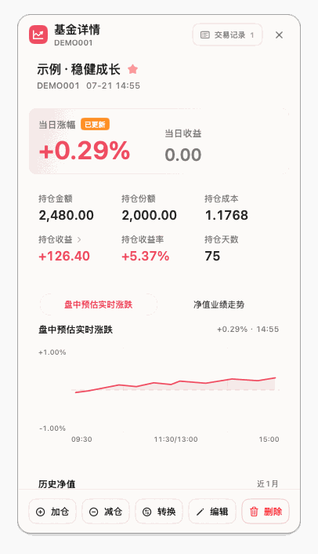
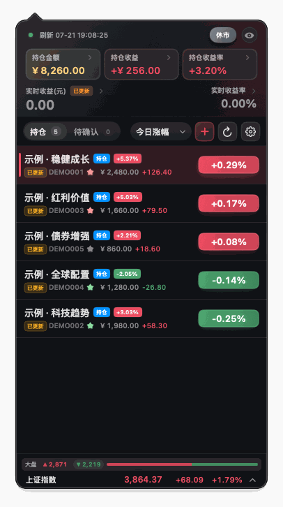
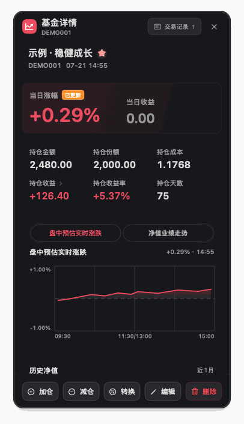
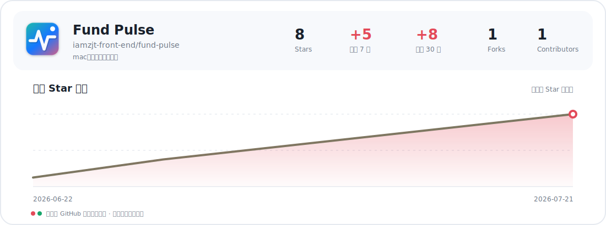

<p align="center">
  
</p>

<h1 align="center">Fund Pulse</h1>

<p align="center">
  <strong>把基金持仓、盘中估值与长期收益，安静地放进 macOS 菜单栏。</strong><br>
  SwiftUI 原生 · 本地优先 · 无广告 · 无自有账号
</p>

<p align="center">
  <a href="https://github.com/iamzjt-front-end/fund-pulse/releases/latest"></a>
  
  
  <a href="https://github.com/iamzjt-front-end/fund-pulse/actions/workflows/test.yml"></a>
  <a href="./LICENSE"></a>
  <a href="https://github.com/iamzjt-front-end/fund-pulse/stargazers"></a>
</p>

<p align="center">
  <a href="https://github.com/iamzjt-front-end/fund-pulse/releases/latest"></a>
  &nbsp;
  <a href="./CHANGELOG.md">更新记录</a>
  ·
  <a href="./PRIVACY.md">隐私政策</a>
  ·
  <a href="https://github.com/iamzjt-front-end/fund-pulse/issues">问题与建议</a>
</p>

> [!IMPORTANT]
> Fund Pulse 是个人基金记录与信息展示工具，不连接券商执行交易，也不构成投资建议。盘中估值来自第三方公开数据，可能延迟、缺失或与最终官方净值不同。

Fund Pulse 是一款原生 macOS 菜单栏应用，用于管理基金持仓、交易记录、盘中估值和组合收益。应用没有自有账号与云端后台，核心数据默认只保存在当前 Mac。

## 核心功能

- **菜单栏速览**：显示组合今日收益、收益率或简洁图标，支持红绿涨跌色与系统单色。
- **持仓与交易**：按金额或份额维护持仓，记录加仓、减仓、基金转换和待确认操作。
- **行情与估值**：展示官方净值、盘中估值、更新时间、市场指数和全市场涨跌概览。
- **收益分析**：提供今日与持仓收益排行、累计收益曲线和每日盈亏日历。
- **京东金融可选同步**：用户主动登录后，可先预览差异，再同步持仓、交易与历史收益。
- **刷新与提醒**：区分交易和休市时段自动刷新，支持每日提醒与涨跌档位通知。
- **本地数据管理**：支持持仓导入、导出、旧版迁移、会话清理和本地数据删除。

## 界面

以下截图使用完全虚构的示例组合，不包含真实持仓数据。

<p align="center"><sub>浅色模式：持仓列表 · 基金详情</sub></p>

<p align="center">
  
  
</p>

<p align="center"><sub>深色模式：持仓列表 · 基金详情</sub></p>

<p align="center">
  
  
</p>

## 安装

系统要求：**macOS 14 Sonoma 或更高版本**，**Apple Silicon（M1 或更新芯片）**。

1. 打开 [Latest Release](https://github.com/iamzjt-front-end/fund-pulse/releases/latest)。
2. 下载名称以 `arm64-swift.dmg` 结尾的安装包。
3. 打开 DMG，将 `fund-pulse.app` 拖入“应用程序”。
4. 启动后在菜单栏找到 Fund Pulse 图标；应用不会在 Dock 常驻。

当前未提供 Intel、Homebrew Cask 或 Mac App Store 版本。请只从本仓库 Release 下载。

> [!TIP]
> 如果 macOS 首次启动时提示无法验证开发者，请先确认安装包来自本仓库，然后在 Finder 中按住 Control 单击应用并选择“打开”，或按“系统设置 > 隐私与安全性”中的系统提示处理。

## 快速开始

1. 首次打开时添加第一只基金、导入已有持仓，或先体验内置的虚构示例组合。
2. 根据自己的记录口径选择金额或份额模式，并填写成本、持仓日期及 15:00 前后归属。
3. 通过基金详情记录加仓、减仓或转换；尚未取得正式净值的操作会保留为待确认。
4. 在设置中调整菜单栏显示、刷新频率、市场概览、主题与本地提醒。
5. 如需京东金融同步，在设置的数据区域主动登录；所有变更都会先显示差异预览，确认后才写入本地账本。

正式收益核对请以基金管理人公布的净值和销售平台确认记录为准，不要把盘中估值当作最终成交结果。

## 数据与隐私

主要数据保存在：

```text
~/Library/Application Support/fund-pulse/
├── portfolio.json
├── settings.json
└── portfolio-performance.json
```

- Fund Pulse 不提供自有账号、云同步或数据后台，也不包含广告与分析 SDK。
- 基金行情和市场概览来自第三方公开接口；GitHub Releases 用于检查和下载更新。
- 京东金融同步只在用户主动操作时运行，相关 Cookie 不会发送给 Fund Pulse 自有服务器或其他行情服务商。
- 持仓可在应用内导入、导出；换机或清理前建议备份整个 `fund-pulse` 目录。
- 如需彻底删除数据，请先退出应用，再删除上述目录。仅删除 `.app` 不一定会移除本地数据。

完整的数据来源、网络边界和删除说明见[《Fund Pulse 隐私政策与免责声明》](./PRIVACY.md)。

## 常见问题

<details>
<summary><strong>盘中估值为什么和销售平台或晚间净值不同？</strong></summary>

盘中估值依赖第三方公开数据与基金披露持仓，更新时间和计算口径可能不同。正式核对请以基金管理人公布的净值和自己的交易确认记录为准。

</details>

<details>
<summary><strong>京东金融登录是必需的吗？</strong></summary>

不是。手工维护持仓、行情展示、菜单栏与本地收益记录都可以独立使用。京东登录只用于用户主动选择的数据同步。

</details>

<details>
<summary><strong>换一台 Mac 后数据会自动同步吗？</strong></summary>

不会。Fund Pulse 没有自有云同步。请先导出持仓，并按需备份 `~/Library/Application Support/fund-pulse` 后再迁移到新设备。

</details>

## 开发

开发环境需要 macOS 14+、Xcode / Command Line Tools 和 Swift 6。Node.js `>= 22.8`、npm `>= 10.9` 仅用于仓库脚本与发布工具。

```bash
git clone https://github.com/iamzjt-front-end/fund-pulse.git
cd fund-pulse
swift build
swift test
```

构建并启动本地应用：

```bash
npm run dev
```

## 贡献与反馈

欢迎提交可复现的问题、范围明确的建议和聚焦的 Pull Request。

- [报告 Bug](https://github.com/iamzjt-front-end/fund-pulse/issues/new?template=issue_template_bug.md)
- [提出功能建议](https://github.com/iamzjt-front-end/fund-pulse/issues/new?template=issue_template_feature.md)
- [查看已有 Issues](https://github.com/iamzjt-front-end/fund-pulse/issues)

提交代码前请先搜索已有 Issue，并为非平凡业务改动补充测试。用户可见变更应添加 `.release-notes/*.md`，提交前至少运行 `swift test` 和与改动相关的仓库测试。

## 支持项目

Fund Pulse 免费、开源且无广告。如果它对你有帮助，欢迎点亮 Star、反馈问题、改进文档或参与贡献。自愿支持作者的入口位于应用“设置 > 支持”，不会解锁额外功能或提供赞助者权益。

## 项目成长

<a href="https://github.com/iamzjt-front-end/fund-pulse/stargazers">
<picture>
  <source media="(prefers-color-scheme: dark)" srcset="./screenshots/star-growth-dark.svg">
  <source media="(prefers-color-scheme: light)" srcset="./screenshots/star-growth-light.svg">
  
</picture>
</a>

## 许可证与免责声明

本项目依据 [GNU General Public License v3.0](./LICENSE) 开源。

Fund Pulse 仅用于个人记录和信息参考，不构成投资建议、要约、招揽或交易依据，也不承诺行情、净值、估值和计算结果完整准确。投资决策及损失由使用者自行承担；完整条款见[《Fund Pulse 隐私政策与免责声明》](./PRIVACY.md)。

<p align="center">
  如果 Fund Pulse 对你有帮助，欢迎点亮一个 ⭐️。<br>
  <sub>Made for a calmer macOS menu bar.</sub>
</p>
