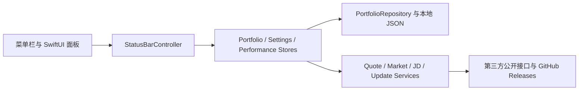

<p align="center">
  
</p>

<h1 align="center">Fund Pulse</h1>

<p align="center">
  <strong>把基金持仓、盘中估值与长期收益，安静地放进 macOS 菜单栏。</strong><br>
  SwiftUI 原生 · 本地优先 · 无广告 · 无自有账号
</p>

<p align="center">
  <a href="https://github.com/iamzjt-front-end/fund-pulse/releases/latest"></a>
  
  
  
  <a href="https://github.com/iamzjt-front-end/fund-pulse/actions/workflows/test.yml"></a>
  <a href="./LICENSE"></a>
  <a href="https://github.com/iamzjt-front-end/fund-pulse/stargazers"></a>
</p>

<p align="center">
  <a href="https://github.com/iamzjt-front-end/fund-pulse/releases/latest"></a>
  &nbsp;
  <a href="./CHANGELOG.md">更新记录</a>
  ·
  <a href="./PRIVACY.md">隐私政策</a>
  ·
  <a href="https://github.com/iamzjt-front-end/fund-pulse/issues">问题与建议</a>
</p>

> [!IMPORTANT]
> Fund Pulse 是面向个人记录的基金信息工具，不连接券商执行交易，也不构成投资建议。盘中估值来自第三方公开数据，可能延迟、缺失或与最终官方净值不同。

## 导航

- [项目定位](#项目定位)
- [项目成长](#项目成长)
- [核心功能](#核心功能)
- [当前界面](#当前界面)
- [安装与首次使用](#安装与首次使用)
- [持仓、交易与收益](#持仓交易与收益)
- [京东金融可选同步](#京东金融可选同步)
- [菜单栏、刷新与提醒](#菜单栏刷新与提醒)
- [本地数据与隐私](#本地数据与隐私)
- [项目架构](#项目架构)
- [本地开发与测试](#本地开发与测试)
- [常见问题](#常见问题)
- [贡献与反馈](#贡献与反馈)
- [支持作者](#支持作者)
- [许可证与免责声明](#许可证与免责声明)

## 项目定位

Fund Pulse 是一款原生 macOS 菜单栏应用：用尽量少的界面干扰，集中管理基金持仓、买卖与转换记录、盘中估值、每日盈亏和组合累计收益。应用没有自有账号和云端后台，核心数据默认只保存在当前 Mac。

| 适合 | 可能不适合 |
| --- | --- |
| 希望在菜单栏快速查看组合今日收益 | 需要 Windows、Linux、iPhone 或 Intel Mac 客户端 |
| 希望手工维护一份可导入、可导出的本地持仓账本 | 需要券商下单、自动交易或投顾服务 |
| 重视本地存储、无广告和透明数据流 | 需要多设备云同步或多人协作 |
| 希望把短期估值与长期收益曲线放在同一个原生工具中 | 要求行情或估值具备交易级实时性与绝对准确性 |

当前仓库只维护 Swift 原生版本，SwiftPM 是唯一应用构建入口；发行渠道目前仅提供 **macOS 14+、Apple Silicon（M1 及更新芯片）DMG**。

## 项目成长

<a href="https://github.com/iamzjt-front-end/fund-pulse/stargazers">
<picture>
  <source media="(prefers-color-scheme: dark)" srcset="./screenshots/star-growth-dark.svg">
  <source media="(prefers-color-scheme: light)" srcset="./screenshots/star-growth-light.svg">
  
</picture>
</a>

这张明暗自适应的成长卡由仓库自己的生成器读取 GitHub REST API 后绘制，展示当前 Stars、最近 7 天和 30 天新增、Forks、Contributors，以及从首个 Star 到现在的累计曲线。它不虚构全球排名，不依赖 Star History 等第三方统计服务；点击卡片可查看本仓库的 Stargazers。

成长卡每天由 GitHub Actions 更新，也可以手动触发。API 请求失败时任务会失败并保留上一版有效 SVG，Token 不会写入图片或日志。实现与测试见 [`scripts/generate-project-growth-card.mjs`](./scripts/generate-project-growth-card.mjs)、[`scripts/lib/project-growth-card.mjs`](./scripts/lib/project-growth-card.mjs) 和 [`scripts/tests/project-growth-card.test.mjs`](./scripts/tests/project-growth-card.test.mjs)。

## 核心功能

| 模块 | 当前能力 |
| --- | --- |
| 菜单栏速览 | 显示今日收益金额、收益率、两者或仅图标；支持红绿涨跌色与系统单色 |
| 持仓管理 | 添加、编辑和清空基金持仓；按金额或份额维护持仓信息；展示总资产、持仓收益与今日收益 |
| 行情与估值 | 获取基金基础信息、官方净值、盘中估值和披露持仓相关行情；显示更新时间与数据状态 |
| 交易记录 | 记录加仓、减仓和基金转换；区分 15:00 前后，支持待确认记录和历史记录维护 |
| 收益分析 | 今日收益排行、持仓收益排行、累计收益曲线、每日盈亏日历，以及估值/已确认状态区分 |
| 市场概览 | 可选展示主要市场指数和全市场涨跌分布 |
| 京东金融同步 | 用户主动登录后，可预览并同步持仓、交易记录和历史收益；同步前提供差异核对 |
| 自动刷新 | 交易时段与休市时段分别设置刷新频率，并根据市场状态采用对应间隔 |
| 本地提醒 | 每日操作提醒，以及基金涨跌达到指定档位后的本机通知与防重复间隔 |
| 数据管理 | 持仓配置导入、导出、旧版数据迁移、京东会话清理与全部持仓清空 |
| 更新体验 | 自动或手动检查 GitHub Releases，新版本下载与安装进度可在应用内查看 |
| 外观 | 跟随系统、浅色、深色主题；可调整主面板高度和菜单栏显示方式 |

## 当前界面

以下四张图片由当前 Swift Debug 应用使用隔离的临时用户目录与完全虚构的组合生成，分别展示浅色与深色模式下的持仓列表和基金详情。所有基金均使用 `DEMO` 代码与“示例·”名称，不包含真实持仓，也不会写入真实的 `portfolio.json` 或收益历史；持仓列表底部保留截图时的公开大盘行情。

<p align="center"><sub>浅色模式：持仓列表 · 基金详情</sub></p>

<p align="center">
  
  
</p>

<p align="center"><sub>深色模式：持仓列表 · 基金详情</sub></p>

<p align="center">
  
  
</p>

## 安装与首次使用

### 系统要求

| 项目 | 要求 |
| --- | --- |
| 操作系统 | macOS 14 Sonoma 或更高版本 |
| 芯片 | Apple Silicon，M1 或更新型号 |
| 安装包 | `fund-pulse-<版本>-arm64-swift.dmg` |
| 网络 | 查看行情、可选京东同步和检查更新时需要；本地账本本身不依赖 Fund Pulse 服务器 |

### DMG 安装

1. 打开 [Latest Release](https://github.com/iamzjt-front-end/fund-pulse/releases/latest)，下载名称以 `arm64-swift.dmg` 结尾的安装包。
2. 双击挂载 DMG，把 `fund-pulse.app` 拖入 `Applications`。
3. 从“应用程序”启动 Fund Pulse；应用以菜单栏配件运行，不会在 Dock 常驻。
4. 在菜单栏找到 Fund Pulse 图标，单击打开主面板，右键打开快捷菜单。

Release 页面会列出安装包信息和 SHA-256，可在安装前核对。当前没有 Homebrew Cask、Intel 安装包或 Mac App Store 版本，请不要从不明镜像下载。

> [!TIP]
> 如果 macOS 首次启动时提示无法验证开发者，请先确认文件来自本仓库 Release，然后在 Finder 中按住 Control 单击应用并选择“打开”，或前往“系统设置 > 隐私与安全性”按系统提示处理。不要随意对来源不明的应用关闭 Gatekeeper。

### 第一次打开

引导页提供四条入口：添加第一只基金、导入已有持仓配置、查看完全虚构且不联网的组合体验，或从空组合开始。建议先打开“组合体验”熟悉持仓、收益曲线和盈亏日历，再录入自己的数据。

录入真实持仓前，请先确认：

- 基金代码和名称与实际产品一致；
- 当前持仓使用金额模式还是份额模式；
- 成本、持仓日期和 15:00 前后归属符合自己的记录口径；
- 盘中估值只是估算，正式核对以基金管理人公布的净值和销售平台记录为准。

## 持仓、交易与收益

### 持仓总览

主面板围绕“组合今天发生了什么”组织信息：总资产、持仓收益、今日收益、基金列表、市场指数和更新时间。基金详情继续展示持仓金额或份额、成本、官方净值、估值、今日与持仓收益，并提供交易和记录入口。

### 交易与待确认

| 操作 | 录入口径 | 确认后的影响 |
| --- | --- | --- |
| 加仓 | 按金额记录，可选择交易日期与 15:00 前后 | 根据确认净值换算份额，并更新持仓与成本 |
| 减仓 | 按份额记录，可选择交易日期与 15:00 前后 | 根据确认净值计算赎回影响，并更新剩余份额 |
| 转换 | 记录来源基金、目标基金、来源份额与时间 | 以关联记录衔接两只基金，避免把转换误当作无关买卖 |

交易日当日尚未取得可确认净值时，记录会进入待确认状态。待数据可用后再确认，可降低把盘中估值直接当作官方成交净值的风险。历史记录可以回看和编辑；京东同步导入的记录也会带有同步来源与去重信息。

### 收益排行、曲线与日历

- **今日收益排行**：按金额或收益率比较当前组合中的基金表现。
- **持仓收益排行**：查看各持仓对累计收益的贡献。
- **累计收益曲线**：支持 1 个月、3 个月、6 个月、1 年和全部范围，正负收益采用红绿语义色。
- **每日盈亏日历**：按月汇总上涨、下跌和估值天数，并查看每个记录日的金额与收益率。
- **状态区分**：当天尚未结算时可显示估值记录；正式数据到达后以已确认记录为准。

组合收益历史会在本地有效刷新后按日积累；如果你希望补全安装 Fund Pulse 之前的记录，可选择使用京东金融历史收益同步。

## 京东金融可选同步

京东金融不是使用 Fund Pulse 的前置条件。只有你主动打开登录或同步页面时，应用才会创建京东 WebKit 会话，并读取完成鉴权所需的京东相关 Cookie。

典型流程如下：

1. 在设置的数据区域打开京东持仓或历史收益同步。
2. 在应用内京东页面完成登录；登录凭据由京东页面处理。
3. Fund Pulse 读取持仓、交易或历史收益数据，先生成本地差异预览。
4. 你确认后才写入本地账本；取消预览不会应用变更。
5. 如不再使用，可在“设置 > 数据 > 京东会话”清除登录数据。

同步逻辑会尽量按基金代码、产品标识和已保存的同步指纹匹配记录，并阻止不同京东账号的历史数据直接混入同一份本地账本。任何无法唯一确认的映射都应在预览中人工核对，而不是依赖猜测。

> [!NOTE]
> Fund Pulse 不会把京东 Cookie 发送到 Fund Pulse 自有服务器、行情服务商或 GitHub。Cookie 的保存与请求发生在本机和京东相关服务之间；完整说明见[隐私政策](./PRIVACY.md)。

## 菜单栏、刷新与提醒

### 菜单栏显示

- 内容：今日收益金额、收益率、金额与收益率同时显示，或仅显示图标。
- 颜色：按涨跌使用红/绿，或使用系统单色。
- 面板：主面板高度可调，外观可选跟随系统、浅色或深色。
- 操作：左键打开面板；右键菜单提供刷新、设置、更新检查和退出等快捷入口。

### 自动刷新

交易时段可选 `2s`、`5s`、`10s`、`30s`、`1m`、`3m`、`5m`；休市时段可选 `1m`、`3m`、`5m`、`10m`、`30m`。应用根据中国市场交易日和时段切换刷新策略，避免休市后仍以高频率请求公开接口。

更短间隔不意味着数据源一定更快更新，也会增加网络请求。日常使用建议从默认间隔开始，只有确有需要时再调高频率。

### 本地提醒

- 每日操作提醒：在设置的时间通过 macOS 通知提醒核对当日记录。
- 涨跌档位提醒：可选择 `2%`、`3%`、`5%`、`7%`、`10%` 档位。
- 防重复间隔：同一基金同类提醒可设置 15 分钟、30 分钟、1 小时、2 小时、4 小时或 1 天内不重复。

提醒由本机调度，不经过 Fund Pulse 推送服务器。首次启用时需要在 macOS 授予通知权限。

## 本地数据与隐私

### 数据文件

Fund Pulse 的主要数据位于：

```text
~/Library/Application Support/fund-pulse/
├── portfolio.json
├── settings.json
└── portfolio-performance.json
```

| 文件 | 内容 |
| --- | --- |
| `portfolio.json` | 基金持仓、金额或份额、成本与收益、待确认操作、交易记录及京东同步状态 |
| `settings.json` | 外观、菜单栏显示、刷新频率、提醒、市场指数与功能开关 |
| `portfolio-performance.json` | 组合每日收益、累计曲线、日历、估值/确认状态和京东历史收益同步范围 |

应用内的持仓导出会同时带上组合收益历史，导入时再恢复到对应本地文件；设置偏好不包含在持仓导出中。进行系统迁移或手工清理前，建议先退出 Fund Pulse 并备份整个 `fund-pulse` 目录。

旧版数据可使用迁移脚本转换到 Swift 数据格式：

```bash
npm run swift:migrate
```

### 网络边界与第三方数据源

| 服务 | 用途 | 可能发送的数据 | 是否发送到 Fund Pulse 自有服务器 |
| --- | --- | --- | --- |
| 东方财富 / 天天基金相关公开接口 | 基金搜索、资料、净值、盘中估值和公开市场信息 | 基金代码、搜索词、公开市场标识 | 否 |
| 腾讯公开行情 | 基金披露持仓所对应的股票行情 | 公开股票代码 | 否 |
| 同花顺公开行情 | 全市场涨跌分布等市场概览 | 公开市场请求参数 | 否 |
| 京东相关服务 | 用户主动发起的持仓、交易和历史收益同步 | 最小必要京东 Cookie 与请求参数 | 否 |
| GitHub Releases | 启动时或手动检查更新、下载发行包 | 版本请求、IP 与常规网络信息 | 否 |
| 微信 / 支付宝 | 用户主动扫码联系或自愿支持作者 | 由相应客户端和平台处理 | 否；应用不读取支付数据 |

Fund Pulse 不提供自有账号、云同步或数据后台，不包含广告 SDK、分析 SDK 或跨应用跟踪。第三方服务可能依据各自政策记录 IP、时间和设备网络信息；Fund Pulse 与这些平台不存在隶属、代理或官方合作关系。

如需彻底删除本地数据，请先退出应用，再删除 `~/Library/Application Support/fund-pulse`。仅删除 `.app` 不一定会删除 Application Support 数据。更多边界、保存期限和删除方式见[《Fund Pulse 隐私政策与免责声明》](./PRIVACY.md)。

## 项目架构

Fund Pulse 使用 SwiftUI 构建视图，以 AppKit 管理菜单栏状态项和无边框面板；状态与持久化由 Store/Repository 层负责，第三方网络请求集中在 Service 层。



关键目录：

```text
fund-pulse/
├── Sources/FundPulse/
│   ├── App/             # SwiftUI App 与 AppDelegate 入口
│   ├── Controllers/     # 菜单栏、面板路由与交互编排
│   ├── Models/          # 持仓、交易、设置、行情和收益模型
│   ├── Views/           # 主面板、编辑器、设置、收益与同步界面
│   ├── Stores/          # 可观察状态、业务事务与本地持久化
│   ├── Services/        # 行情、京东会话、市场指数和更新请求
│   ├── Support/         # 计算、匹配、日历、格式化和迁移辅助逻辑
│   └── Resources/       # 随应用分发的本地静态资源
├── Tests/FundPulseTests/ # Swift 单元与集成测试
├── script/               # Swift 应用构建与 DMG 打包脚本
├── scripts/              # 发布、迁移、成长卡与 Node 测试工具
├── .release-notes/       # 待发布的用户可见变更片段
└── .github/workflows/    # CI、发布、安全扫描与成长卡更新
```

核心运行链路：

1. `FundPulseApp` 创建持仓、设置、市场和更新 Store。
2. `StatusBarController` 创建菜单栏图标、主面板与子面板，并编排刷新和通知。
3. SwiftUI View 读取 Store 状态并把用户操作提交给对应业务方法。
4. Store 通过 Service 获取外部数据，通过 Repository 原子写入本地 JSON。
5. 组合收益记录器把有效的每日状态合并到 `portfolio-performance.json`，供曲线和日历使用。

## 本地开发与测试

### 环境准备

- macOS 14 或更高版本
- Xcode / Command Line Tools，能够使用 Swift 6
- Node.js `>= 22.8` 与 npm `>= 10.9`，用于发布、迁移和 README 工具

仓库没有前端运行时依赖，也不再包含 Electron 应用。克隆后可以直接使用 SwiftPM：

```bash
git clone https://github.com/iamzjt-front-end/fund-pulse.git
cd fund-pulse
swift build
```

### 运行与构建

```bash
# 构建并启动本地 Swift 应用
npm run dev

# 只执行 SwiftPM 构建
npm run build

# 验证并构建应用包
npm run swift:verify
```

Debug 应用产物位于 `dist/fund-pulse.app`。本地运行脚本会结束旧的 Fund Pulse 实例并启动刚构建的应用，运行前请先保存正在编辑的应用内数据。

### 测试

```bash
# Swift 业务、持久化、视图集成与资源测试
swift test

# README 项目成长卡测试
npm run test:readme

# Release Notes、发布状态机与发布工具测试
npm run test:release

# 最终编译检查
npm run build
```

现有 Swift 测试还会校验支持作者二维码的可识别性、明暗主题渲染和资源完整性。新增非平凡业务逻辑时，请先补齐失败用例，再实现代码，并避免用 UI 兜底掩盖 Store 或 Service 层错误。

### 打包

```bash
npm run package
```

产物写入 `release/swift/`，包括 Apple Silicon ZIP、DMG 和更新清单。打包脚本拒绝无签名或 ad-hoc 签名；公开分发应配置 Developer ID Application 证书与公证凭据。Apple Development 签名只适合本地或测试分发。

### 本地更新成长卡

```bash
GITHUB_TOKEN=<具有仓库 Metadata 读取权限的令牌> npm run readme:growth
```

生成器固定使用 `--repo`、`--output-dir` 和 `GITHUB_TOKEN`，分页读取 Stargazers 与 Contributors，转义所有外部文本，并在成功取得完整数据后才替换明暗 SVG。工作流只授予 `contents: write`，只有图片内容变化时才提交：

```text
chore(readme): refresh project growth card [skip ci]
```

<details>
<summary><strong>维护者：Release Notes、dry-run 与正式发布流程</strong></summary>

每项面向用户的变更都应在 `.release-notes/` 添加一个 Markdown 片段，并与对应代码一起提交：

```markdown
---
type: optimization
---

行情刷新改为串行合并，避免并发请求造成状态覆盖。
```

支持的类型为 `breaking`、`feature`、`fix`、`optimization` 和 `other`。正文使用一句面向用户的中文说明，不要填写提交标题、实现清单或占位内容。

发布前要求：位于 `main`、工作区完全干净、与 `origin/main` 同步、业务改动已单独提交。先执行完整 dry-run：

```bash
npm run release:dry
```

确认预检、说明、测试和产物规划无误后，再正式发布：

```bash
npm run release -- --yes
```

发布脚本会更新版本和 `CHANGELOG.md`、消费本次说明片段、构建并校验 ZIP/DMG/更新清单，先创建 Draft Release，远端资产检查通过后再公开。没有变更片段时默认拒绝发布；纯重新打包必须显式使用 `--allow-empty-notes`。不要绕过 Draft、签名、公证或 SHA-256 校验直接上传产物。

</details>

## 常见问题

<details>
<summary><strong>为什么没有 Intel、Homebrew 或其他平台版本？</strong></summary>

当前构建、签名和发布链只验证 Apple Silicon 与 macOS 14+。在对应实现、CI 和真实设备验证完成前，README 不会把未提供的渠道写成已支持能力。

</details>

<details>
<summary><strong>盘中估值为什么和销售平台或晚间净值不同？</strong></summary>

盘中估值根据第三方公开数据估算，基金披露持仓、股票行情、更新时间和平台算法都可能不同。正式收益核对请以基金管理人公布的官方净值和自己的交易确认记录为准。

</details>

<details>
<summary><strong>京东金融登录是必需的吗？</strong></summary>

不是。手工维护持仓、行情、菜单栏和本地收益记录都可以独立使用。京东登录只用于你主动选择的持仓、交易或历史收益补全。

</details>

<details>
<summary><strong>换一台 Mac 后数据会自动出现吗？</strong></summary>

不会。Fund Pulse 没有自有云同步。请先在旧 Mac 导出持仓，并在需要时额外备份 `~/Library/Application Support/fund-pulse` 中的三个数据文件，再在新 Mac 导入或恢复。

</details>

<details>
<summary><strong>为什么菜单栏只剩图标？</strong></summary>

检查“设置”中的菜单栏内容模式是否选择了“都不显示”。该模式只保留图标，适合隐藏金额，并不是行情加载失败。

</details>

<details>
<summary><strong>如何彻底清除本地数据或京东会话？</strong></summary>

京东会话可在“设置 > 数据 > 京东会话”中单独清理；持仓和收益可以使用“清空所有持仓”。如需彻底移除，请退出应用后删除 `~/Library/Application Support/fund-pulse`，并提前备份要保留的内容。

</details>

## 贡献与反馈

欢迎报告可复现的问题、提出范围明确的功能建议或提交 Pull Request。

- [报告 Bug](https://github.com/iamzjt-front-end/fund-pulse/issues/new?template=issue_template_bug.md)
- [提出功能建议](https://github.com/iamzjt-front-end/fund-pulse/issues/new?template=issue_template_feature.md)
- [查看已有 Issues](https://github.com/iamzjt-front-end/fund-pulse/issues)
- 邮件联系：<iamzjt@foxmail.com>

提交代码前建议遵循：

1. 先搜索已有 Issue，说明 macOS 版本、Fund Pulse 版本、复现步骤、预期和实际结果。
2. 从最新 `main` 创建分支，保持改动聚焦，不混入无关格式化或生成文件。
3. 非平凡逻辑先写测试；至少运行 `swift test`、`npm run test:release`、`npm run test:readme` 和 `npm run build`。
4. 用户可见变更添加 `.release-notes/*.md`；隐私或第三方数据边界变化同步更新 `PRIVACY.md`。
5. Pull Request 说明行为变化、验证证据、数据迁移影响和可见界面截图。

参与贡献即表示你同意将贡献按本项目的 GPL-3.0 许可证发布。

## 支持作者

Fund Pulse 免费、开源且无广告。如果它长期帮助你更轻松地查看持仓，可以自愿支持作者；也可以通过 Star、Issue、文档修正或代码贡献支持项目。

<p align="center">
  
  &nbsp;&nbsp;
  
</p>

支持完全自愿，不会解锁额外功能，不提供赞助者权益。支付由微信或支付宝处理；Fund Pulse 不读取、上传或保存支付信息。扫描前请自行确认收款页面，详情见[隐私政策中的“自愿支持作者”](./PRIVACY.md#5-自愿支持作者)。

## 许可证与免责声明

本项目依据 [GNU General Public License v3.0](./LICENSE) 开源。你可以在许可证条款下使用、研究、修改和分发代码；再分发时请保留相应版权与许可证声明，并按 GPL-3.0 提供对应源码。

Fund Pulse 仅用于个人记录和信息参考，不构成投资建议、要约、招揽或交易依据，不承诺行情、净值、估值、持仓披露和计算结果完整准确，也不承诺任何投资收益。投资决策及损失由使用者自行承担。完整条款见[《Fund Pulse 隐私政策与免责声明》](./PRIVACY.md)。

<p align="center">
  如果 Fund Pulse 对你有帮助，欢迎点亮一个 ⭐️。<br>
  <sub>Made for a calmer macOS menu bar.</sub>
</p>
